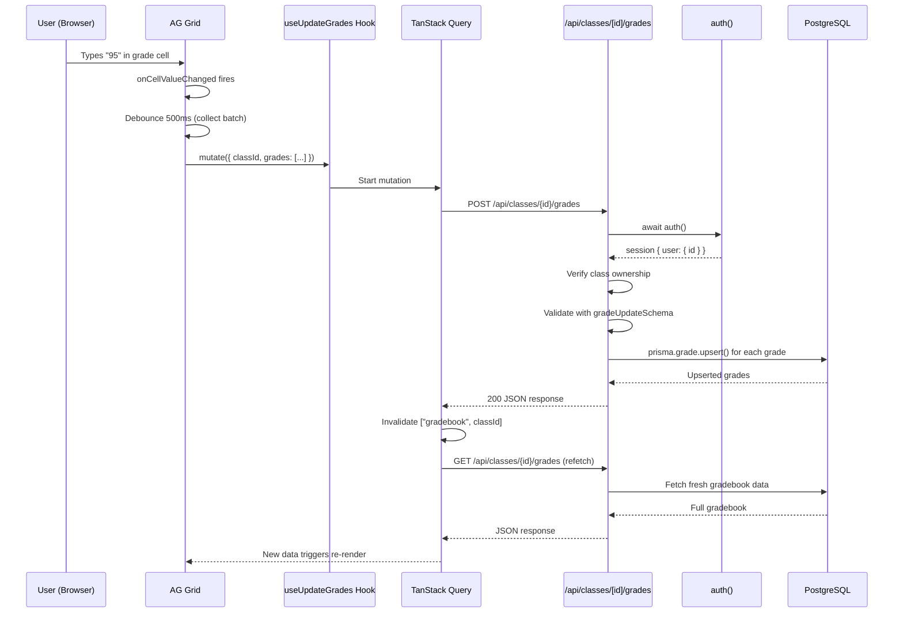

# Request Lifecycle

How data flows from a UI action to the database and back.

---

## The Standard Path: Click to Database

Using "teacher enters a grade" as the example:



---

## The Mutation Pattern (used everywhere)

Every data-modifying action follows this pattern:

```
1. Component calls hook's mutate/mutateAsync
2. Hook sends fetch() to API route
3. API route:
   a. auth() -> get userId
   b. Validate ownership (class.userId === userId)
   c. Validate input (zod schema)
   d. Prisma operation
   e. Return JSON
4. Hook's onSuccess:
   a. Invalidate relevant query keys
   b. Show toast notification
5. TanStack Query refetches invalidated queries
6. Components re-render with new data
```

---

## Example Flows

### Adding a Student

```
QuickStudentEntry: user types "Jane Doe", presses Enter
  -> useAddStudent.mutateAsync({ classId, student_name: "Jane Doe" })
    -> POST /api/classes/{id}/students  { student_name: "Jane Doe" }
      -> studentSchema.safeParse()
      -> parseStudentName("Jane Doe") -> { firstName: "Jane", lastName: "Doe" }
      -> prisma.student.create()
    <- 201 { id, firstName, lastName, ... }
  -> invalidate ["students", classId] + ["classes"]
  -> toast.success("Student added")
  -> input clears, green check appears for 1 second
```

### Dashboard Load

```
DashboardClient mounts
  -> useQuery(["dashboard"]) fetches /api/dashboard
  -> useGenerateTasks().mutate() fires once (ref guard)
    -> POST /api/tasks/generate
      -> Creates PLANNING tasks (sourceKey dedup)
      -> Creates GRADING tasks (title dedup)
      -> Creates EXAM tasks (title dedup)
    <- { created: N, tasks: [...] }
  -> invalidate ["tasks"] + ["dashboard"]
  -> Dashboard re-renders with stats, schedule, task feed
```

### Creating a Class with Placeholder Students

```
ClassForm: user fills form, sets studentCount = 25, submits
  -> useCreateClass.mutateAsync({ name, subject, color, schedules })
    -> POST /api/classes  { ... }
    <- 201 { id: "newClassId", ... }
  -> fetch(`/api/classes/newClassId/students`, { body: { count: 25 } })
    -> POST /api/classes/{id}/students  { count: 25 }
    -> prisma.student.createMany() -- "Student 1" through "Student 25"
    <- 201 { created: 25 }
  -> Dialog closes, class list refetches
```

### Task Drag-and-Drop Reorder

```
TaskList: user drags task from position 3 to position 1
  -> Zustand: setOptimisticTasks(reorderedList)  // instant UI update
  -> useReorderTasks.mutate(newTaskIdOrder)
    -> POST /api/tasks/reorder  { taskIds: [...] }
    -> Each task gets priority = index in array
  -> onSettled: invalidate ["tasks"]
  -> Zustand: setOptimisticTasks(null)  // clear optimistic state
```

---

## Cache Invalidation Map

When a mutation succeeds, which queries get invalidated:

| Mutation | Invalidates |
|----------|-------------|
| Create/update/delete class | `["classes"]` |
| Add/delete student | `["students", classId]`, `["classes"]` |
| Update student | `["students", classId]` |
| Create/delete assignment | `["gradebook", classId]` |
| Update grades | `["gradebook", classId]` |
| Create/update/delete task | `["tasks"]`, `["dashboard"]` |
| Generate tasks | `["tasks"]`, `["dashboard"]` |
| Reorder tasks | `["tasks"]` |
| Update settings | `["settings"]` |
| Unit plan CRUD | `["unit-plans", classId]` |
